# Events in Software, Process, and Reality

This is an experimental talk. My slightly random starting point for my talk today is something Eric Evans said in
 the keynote he gave at this conference last year, in which he discussed modelling time. He asked the very interesting question, "What if we didn’t have instants?"

I’m going to talk about events, warming up with some hopefully obvious stuff, working towards the concept of the event as an occasion of experience as proposed by Alfred North Whitehead. I will end with some examples.

Firstly, let’s see what the dictionary says about events…

> "An event is something that happens. You can use events to describe all the things that are happening in a particular situation."

Let’s get started by thinking about events in software. Perhaps it’s a file on a computer. But even if it’s printed on paper, it’s a fact of at least one episode or occasion of software development, the process by which it was created. Hopefully, it’s also something that actually runs on a computer.

When a program runs, there are lots of events. A high-level program will be parsed somehow. Something is compiled, byte code or machine code. Machine code runs. Transistors switch. Electrons move. There are events within events, and events followed by events.

Now let's say we run a software application that has a domain model in a layered architecture, perhaps it’s even a domain driven design. Let’s say the model has aggregates and value objects. Let’s say we have entities representing different things we find in the domain. And let’s say the model changes are NOT coded explicitly as domain events.

If we don’t code explicitly for events — for “what happened” — then we can’t expect afterwards directly to determine exactly what changed in the model. That means any notification messages about the change must be published when the database is updated. In this case, sending the notification message is separate from updating the database. So a message could be sent about something that wasn’t recorded in the database, or something could be recorded in the database without a message being sent. In consequence, infrastructure failures can affect the state of a distributed system which propagates state in this way.

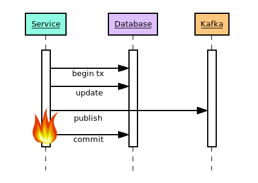

> CRUD is the wrong approach for microservices. — James Roper, 2017

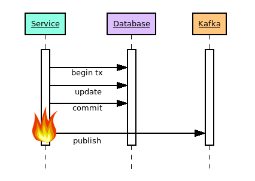

On the persistence level, the records are effectively damaged. But on the level of the domain, what is is broken is the subsequent perception of “what happened” previously on the level of the domain: the perception is that something else happened. We can’t eliminate infrastructure failure, but we can eliminate misperceptions, so long as we can identify what’s actually happening in the processing. Just before we do that, let’s think about objects…

Here’s Martin Fowler in 2002, in his book Patterns of Enterprise Application Architecture, which I really loved.

> “To build a good domain model, you should have an understanding of conceptual thinking about objects”.

So what does that actually mean? What does it mean to “have an understanding of conceptual thinking about objects?” I used to feel that I knew what he meant. Fowler mentioned that Eric Evans is writing a book.

> “Eric Evans is currently writing a book…”

So let’s see what Eric Evans said about objects in 2003. Here’s Eric Evans discussing his use of pattern language in his great book Domain Driven Design. I also really loved this book. When it comes to understanding objects, he said,

> To stop with ‘Everything is an object’ would be like a carpenter or an architect summing up houses by saying, ‘Everything is a room.’ [...] There is a need to move beyond ‘Everything is an object’ to at least the equivalent of distinguishing bolts from springs.

Bolts and springs. Are those the actual entities? I used to think so.

So what is an object? Here are three definitions.



* Object in classical analysis: the actual entities are material instances of substance-quality categories (an inadequate idea from the Greeks, via Descartes).

* Object in software: the collocation of state and behaviour in a computer program, an improvement on having data structures with function pointers.

* Object in process philosophy: the actual entities are actual occasions of experience (events).

The first one is basically an inadequate idea, for various reasons. The second one is a great idea. But what some of us have been doing, for many years, is to represent the first one with the second one, to represent objects of classical analysis with software objects.

On the other hand, when we code for domain events, we use software objects to model events. An increasing number of people seem to be doing that.

What’s the real difference?

The trouble with objects seems to be, what Alfred North Whitehead called “the fallacy of misplaced concreteness”.

> The current accounts of perception are the stronghold of modern meta-physical difficulties. They have their origin in the same misunderstanding which led to the incubus of the substance-quality categories. The Greeks looked at a stone, and perceived that it was grey.

But of course, now, after so many event sourcing presentations that have included this picture, whereas the Greeks looked at stone and perceived that it was grey, we look at this stone and perceive event-sourcing.

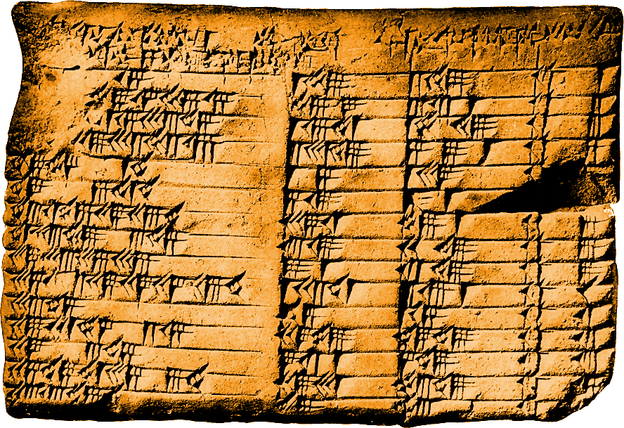

Just to give a quick introduction for those who haven’t heard about it before, event sourcing is an architectural pattern in which the state of the application is determined by a sequence of events. Event sourcing can be used as a persistence mechanism for Domain Driven Design.

We can use domain event objects to represent “what happened” in the model, and store these domain events in a database.

Storing events supports reliable propagation of application state, because if the events are in a sequence, then others can then follow that sequence.

 See, for example, the notification log design from Vaughn Vernon.

The big question I had was how applicable event sourcing really was, if it is not universally applicable, why would that be. When would it lead straight to disaster, and why? I had no reason to think there was really anything general about events. But I also had no reason to be precautious, except for that blog post which said using event sourcing for everything is an anti-pattern. If thinking about events really did support a general approach, it seemed to touch on my sense of reality itself, in a way that made me feel slightly unsettled. But I wanted to know what the answer was.

So as Eric Evans said at the end of his talk last year:
 
> Research the established formalisms.

And so, I looked again into process philosophy...

The basic idea of process philosophy seems to be that the future doesn’t exist. And also the past is dead. Process philosophy has a long tradition.

In Western thought, process philosophy is traced back to Heraclitus (c. 535 – c. 475 BCE) a pre-Socratic Greek philosopher, who was famous for his insistence on ever-present change as being the fundamental essence of the universe, as stated in the famous saying, "No one ever steps in the same river twice". This is commonly considered to be one of the first digressions into the philosophical concept of becoming. The phrase “nothing in this world is constant except change and becoming” is attributed to Heraclitus.

Process philosophy is now primarily associated with Alfred North Whitehead.

In the 1920s, Whitehead wrote:
“The ancient doctrine that 'no one crosses the same river twice' is extended. No thinker thinks twice; and, to put the matter more generally, no subject experiences twice.”

He follows on by saying, “This is what Locke ought to have meant by his 
doctrine of time as a 'perpetual perishing.’”

For Heraclitus, “everything flows”. But for modern philosophy, such absolute becoming is the happening of events.

It happens that the Biblical phrase “come to pass” works well, since events don’t change, they just become and then perish.

> Process is the becoming of experience.

In 1929, aged 68 years old, Alfred North Whitehead published a book called Process and Reality.

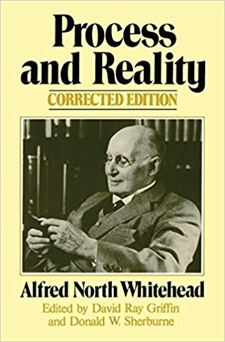

As far as I can tell, there were eight contemporary book reviews of the 1929 edition.

Axton Clark in New York Times Book Review, January 5 1930, wrote: “Perhaps the situation can best be made clear by saying bluntly that [this work surpasses] Aristotle’s “Metaphysics” and Kant’s “Critique of Pure Reason” for intrinsic importance, though naturally not as yet for historical standing or influence.”

Wieman wrote in his 1930 review: "Not many people will read Whitehead's recent book in this generation; not many will read it in any generation. But its influence will radiate through concentric circles of popularization until the common man will think and work in the light of it, not knowing whence the light came. After a few decades of discussion and analysis one will be able to understand it more readily than can now be done.”

## Introduction to the man

Whitehead was born in 1861, and died in 1947. It was said, he was a genial sort of person….

He was professor of mathematics at Cambridge and later professor of philosophy at Harvard.

_Principia Mathematica_ (1910–1913) is Whitehead's most famous mathematical work. Co-written with former student Bertrand Russell, _Principia Mathematica_ is considered one of the twentieth century's most important works in mathematics, and placed 23rd in a list of the top 100 English-language nonfiction books of the twentieth century. So he his already quite famous because of that.

In his later life, he moved to Harvard and started on his philosophical work.

Alan Turing read Whitehead’s _Science and The Modern World_ when Turing was at school.

_Process and Reality_ is his masterpiece. Allegedly, we have the word “creativity” in the English language because of this book.

We also get the notion of expression e.g. in DNA biology stuff from Whitehead, from his writing about the idea of reality creating reality, rather than nature somehow being created by a supernatural being in a process of creation.

[In biology, Conrad Waddington had a strong interest in Whitehead’s Process and Reality, and in the 1930s laid the
 foundations for developmental biology, which is the study of the process by which animals and plants grow and
  develop. Brian Goodwin was one of Waddington’s students, and continued this work, writing about how cells control themselves.]
 

[Whitehead had a son who was killed in the First World War.]

[In 1968, Giles Deleuze wrote in Difference and Repetition that Whitehead’s Process and Reality is “one of the
 greatest books of modern philosophy.”]

[It was Goedel encounter’s with Whitehead and Russell’s work when Goedel declared that “counting works” (if there’s
 a difference between the theory and counting, then we know the theory is wrong because counting works).]

[Whitehead was a contemporary of Einstein, and went to some of the same parties. Apparently Whitehead and Einstein
 met at least once. Whitehead tried to explain Process and Reality to Einstein, who allegedly didn’t understand what
  Whitehead was talking about.]

[Another person who met and discussed with Einstein was Carnap, who wrote in his auto-biography: “Once Einstein said
 that the problem of the Now worried him seriously. He explained that the experience of the Now means something
  special for man, something essentially different from the past and the future, but that this important difference does not and cannot occur within physics. That this experience cannot be grasped by science seemed to him a matter of painful but inevitable resignation. I remarked that all that occurs objectively can be described in science; on the one hand the temporal sequence of events is described in physics; and, on the other hand, the peculiarities of man’s experiences with respect to time, including his different attitude towards past, present, and future, can be described and (in principle) explained in psychology. But Einstein thought that these scientific descriptions cannot possibly satisfy our human needs; that there is something essential about the Now which is just outside the realm of science. We both agreed that this was not a question of a defect for which science could be blamed, as Bergson thought. I did not wish to press the point, because I wanted primarily to understand his personal attitude to the problem rather than to clarify the theoretical situation. But I definitely had the impression that Einstein’s thinking on this point involved a lack of distinction between experience and knowledge.”]

[Whitehead’s work isn’t detached from science, and doesn’t somehow conflict with mathematics. Minkowski It seems to
 work quite well with quantum fields. There are quite a few living scientists arguing along the following lines
 , articulated by Henry Folse in 2004: “Many philosophers and physicists—including the current reviewer—have argued that Whitehead's process philosophy provides a conceptual framework better suited for understanding the quantum theoretical account of the atomic domain than does the substance ontology that has dominated Western metaphysics.”]

[Actually, to digress a little, after spending some time reading Whitehead and thinking about software, I was
 beginning to worry about how it all relates to design patterns. It seemed like a bad case of multiple inheritance - how does something that originates in the design of physical space fit with the proposition that everything is an event? I really didn’t know what to think. But then it occurred to me to see if pattern language isn’t in fact more or less a creative application of Whitehead’s theory. That’s obviously putting it too simply, but it turns out that it is, and so there is absolutely nothing to resolve. So a bit later in this talk, I’ll say a few things about pattern language, in order to illustrate Whitehead’s ideas, and also how Whitehead has illuminated our work, as predicted by the book reviewer.]

[Whitehead actually says quite a lot about patterns. He refers to: the qualitative pattern; the pattern of intensive
 quality; pattern in the objective datum; and emotional sensory pattern.]

[(These distinctions also seem to be the distinction in pattern languages such as Domain Driven Design: the pattern
 as a whole, the pattern as a network of centres, the physical implementation of the pattern, and the way the
  pattern feels).]
  
Process and Reality appears as a thoroughly competent reworking of the major “depositions” in the history of philosophy: to isolate things that work; and to compose those fragments into a coherent scheme of ideas.

In Process and Reality, amongst other things, Whitehead rejects the Cartesian idea that reality is fundamentally
 constructed of bits of matter that exist totally independently of one another, in favour of an event-based or "process" ontology in which events are primary and are fundamentally interrelated and dependent on one another:

> ‘Actual entities’ — also termed ‘actual occasions’ — are the final real things of which the world is made up. There is no going behind actual entities to find anything more real. They differ among themselves: God is an actual entity, and so is the most trivial puff of existence in far-off empty space. But, though there are gradations of importance, and diversities of function, yet in the principles which actuality exemplifies, all are on the same level. The final facts are, all alike, actual entities; and these actual entities are drops of experience, complex and interdependent.

So this is what happens when you don’t have instants. If time is not a line that we’re sliding along, with the moment being a point on that line, infinitely divided into an infinity of infinitesimal present moment points in time.

Todo: add video of sun

Whitehead wrote, “The perfect moment is fadeless in the lapse of time. Time has […] lost its character of ‘perpetual perishing’, it becomes the moving image of eternity”.

We can picture eternity as a ball, surrounded by the void of the time to come, with the past as layers underneath, and the present distributed around a surface made of evanescent (fading) events, effervescing (bubbling) into the future, making it happen.

Let’s remember this fire, and look again at some of what Christopher Alexander had to say, to see how Alexander’s work was illuminated by Whitehead’s work, so that we can see how Whitehead has illuminated our work.

I was beginning to wonder what the connection was between pattern language and events, but it turns out that Whitehead had an enormous influence on Christopher Alexander. Whitehead actually says quite a lot both about patterns and about language in his book. Pattern language was popularised by the book A Pattern Language For Towns And Cities, which was published in 1977.

In 1987, Kent Beck and Ward Cunningham began experimenting with the idea of applying patterns to programming. Ward Cunningham, wrote in a paper he co-authored with Michael Mehaffy, that wikis "were in fact developed as tools to facilitate efficient sharing and modifying of patterns.”

Martin Fowler suggested “patterns create a vocabulary about design”.

> Patterns have been around for a long time. […] Patterns create a vocabulary about design, which is why naming is such an important issue. — Martin Fowler, 2002

Eric Evans described pattern language as, “a form for sharing and standardising design insight”.

> A form for sharing and standardising design insight was introduced in the 1970s by a group of architects led by Christopher Alexander. […] The language of patterns is now a mainstream technique for organising software design ideas. — Eric Evans, 2003

In 1979, Alexander published a book called _The Timeless Way of Building_, which functions as a general theory and guide for pattern language in general. Guiding the reader towards what he called the “quality without a name”, Alexander writes in his introduction:

> When a building has this fire, then it becomes a part of nature. Like ocean waves, or blades of grass, its parts are governed by the endless play of repetition and variety created in the presence of the fact that all things pass. This is the quality itself. — Christopher Alexander, 1979

Like Whitehead, Alexander describes “becoming coherent” within “things that pass” that is the quality that makes those things alive.

> The process of unfolding goes step by step, one pattern at a time. [...] Indeed, this subtle and complex freedom from inner contradictions is just the very quality which makes things alive. [...] At this final stage, the patterns are no longer important: the patterns have taught you to be receptive to what is real”

And by real he means things that pass (events).

There is the becoming a part of nature, and also becoming receptive to what is real. The same two aspects, of physicality and mentality, have led others to create a split theory of reality: for example Descartes’ mind-body duality: one theory of reality for mind and another for body. Whitehead avoids that by making each event have both to some degree, he calls them the physical and the mental poles. But the main point here is that Alexander is obviously trying to say the actual entities are occasions of experience.

A pattern language is a collection of individual pattern descriptions. Each pattern description follows a standard form, call the Alexandrian form, after Christopher Alexander.

Each pattern has a name. A good name would function as an abbreviated description of the pattern.

Next comes the context to which the pattern may apply.

Next, after a “therefore” statement, comes the steps to apply the pattern, which resolves the context, resulting in a greater coherence or harmony. “Freedom from inner contradictions.”

Then, we have more details about the implementation, with examples, and possibly also links to related patterns in the language.

I’ve marked the different parts of the Alexandrian form with the four different stages of an event suggested by Whitehead: datum, process, satisfaction, and decision.

What I’m saying is that patterns describe events, and when considering the appropriate form of description for your next pattern language, it seems to me that you can safely stray from the Alexandrian form if you want to, so long as you don’t stray from Whitehead’s form and make sure to address the four stages: datum, process, satisfaction, and decision. Which is what Alexander seems to have done.

Ward Cunningham authored a number of pattern languages, for example EPISODES published in 1995.

EPISODES describes a method of software development. In this pattern language, everything is an event. The really remarkable fact about this text, the reason I included it in this talk, is the close resemblance to what Whitehead said about events. In particular, the four stages of an event, and the notion of becoming, are quite visible here.

> We are particularly interested in the sequence of mental states that lead to important decisions. We call the sequence an episode. An episode builds toward a climax where the decision is made. Before the decision, we find facts, share opinions, build concentration and generally prepare for an event that cannot be known in advance. After the climax, the decision is known, but the episode continues. In the tail of an episode we act on our decision, promulgate it, follow it through to its consequences. We also leave a trace of the episode behind in its products. It is from this trace that we must often pick up the pieces of thought in some future episode.

To what degree do other software development approaches apprehend that everything is an event? I’m not saying nothing can work unless propositions are expressed in terms of events.

* Episodes, pattern language of events
* XP, pattern language of practices?
* Scrum, mixture of “scrum events” and less definite things
* Agile Manifesto, values and principles…?
* PoEAA and DDD, “event” not in index of either book
* TCR, smallest possible occasion of software development?
* Cynefin (“Kih-neh-vihn”), characterised degrees of event? 

And there isn’t time to give an assessment of each. But if it’s true that the only thing any approach or description can inspire is an event, then perhaps the descriptions that are most definite about describing human process as an event will also have the most impetus?

If we just dwell on Scrum for a moment…

> Prescribed events are used in Scrum to create regularity and to minimize the need for meetings not defined in Scrum. All events are time-boxed events, such that every event has a maximum duration. Once a Sprint begins, its duration is fixed and cannot be shortened or lengthened. The remaining events may end whenever the purpose of the event is achieved, ensuring an appropriate amount of time is spent without allowing waste in the process.
>
> Other than the Sprint itself, which is a container for all other events, each event in Scrum is a formal opportunity to inspect and adapt something.

I think it’s interesting that Scrum defines “Scrum Events”. Each event is associated with a particular kind of fact that is effectively the decision of the event. We also have the idea of events happening within events, and also of events happening after events. Since it seems so well defined, why is there so much trouble and strife about how it is actually used?

> “Part of the big problem with the whole Scrum/Agile movement is you’ve got some great practices but you haven’t worked out the underlying theory yet, and until you work out the underlying theory it won’t scale and it won’t have bite, other than in isolated cases.” — Dave Snowden, 2011
 
So let’s see what else there is to know about Whitehead’s theory of events.

Let’s briefly look at the episode which gave us Process and Reality.

I’ve arranged this slide following Whitehead’s four stages of an event: datum, process, satisfaction, decision.

* Gifford Lectures (1927-28), Process and Reality (1929)
* datum includes texts of Plato, Aristotle, Thomas Aquinas, Descartes, Spinoza, Newton, Leibniz, Locke, Berkeley, Hume, Kant, Hegel, Bergson, …
* process includes feelings he shared with the others, excludes feelings he doesn’t share, feels forward towards a
 coherent system of ideas, e.g. multiplicity of actual entities, occasions of experience, process, becoming
* satisfaction coherent system of ideas called “philosophy of organism” with the claim, “the actual world is built
 up of actual occasions”
* decision in the form of a printed book, Process and Reality, a little bit botched in the printing process

First the datum. Whitehead read the Greeks in Greek when he was a boy. We can read in his book Process and Reality that Whitehead found the considerations of the Greeks and the ideas of Plato, Aristotle, Descartes, Kant, Hume, Newton, and so on… a mixed bag: although he found many things he liked, to which as he says he “recurred”, he felt there was an overall incoherence, and individually their ideas mistaken in various ways, and in consequence rather laboured. Whitehead wrote: “An endeavour has been made to point out the exact points of agreement and of disagreement.”

He appropriates their work, makes his own propositions, reworking things whilst giving lectures until he reaches a satisfaction. Then his book is printed. All his notes and manuscripts were destroyed when he died, on his wishes. So all we’ve got is this book. That was Whitehead’s process.


I don’t have time here to go into which ideas he took from whom, and what he rejected, except to say he takes the notion of a multiplicity of actual entities from Descartes, and rejects the substance-quality form in favour of “occasions of experience” which he takes from Locke. He says his system of ideas is also a monadology, like that of Leibniz, but the difference is that Whitehead’s monads don’t change. I mention this shift in the meaning of “multiplicity of actual entities” because it seems to describe the turn to event sourcing and event storming within the domain modelling community.


The satisfaction is the coherent system of ideas called “philosophy of organism”, which contains the claim that “the actual world is built up of actual occasions”.

The decision comes in the form of a printed book, Process and Reality, which apparently was a little bit botched in the printing process. Partly because Whitehead didn’t seem to enjoy copy editing very much, and also because one of his publishers thought his manuscript needed explaining a bit more, so changed a few things. That’s why a “corrected” edition was published in 1979.

Now, let’s look at the scheme of ideas itself. Whitehead called the system of ideas in his book Process and Reality, the “philosophy of organism”. Philosophy of organism is the doctrine that the creative advance of the world is the becoming, the perishing, and the objective immortalities of those things which jointly constitute stubborn fact.

Whitehead writes, “The philosophy of organism is a cell-theory of actuality. Each ultimate unit of fact is a cell-complex, not analysable into components with equivalent completeness of actuality. The cell can be considered genetically and morphologically.”

I’ll try to quickly skate over the main concepts, as it relates to domain driven design.

* creativity
* occasion of experience
* event
* society
* eternal object
* world
* theory of feeling
* conscious intellectuality 
* personal order
* corpuscular society
* theory of extension
* living persons

At the top of the list is creativity. Creativity is the universal of universals, the highest generality at the base of actuality, without character, like Aristotelian ‘matter’ is without character.

Then we have occasions of experience, which “perish, but do not change; they are what they are.” Which is exactly like the immutable design of domain events in event sourcing. The so-called actual entities are actual occasions of experience (a statement which is reflected in the database entities of a domain event store).

Whitehead wrote, “I shall use the term 'event' in the more general sense of a nexus of actual occasions, inter-related in some determinate fashion in one extensive quantum. An actual occasion is the limiting type of an event with only one member.”

And since he mentions “quantum”, I think it’s worth mentioning that quantum field theory is an important part of modern physics, it is the field that is quantised and each quantum has a history of state, resulting from events, which are the particles. But I digress…

Next, we have Whitehead’s notion of a society, which is when the elements of a nexus are united by a “defining characteristic” that is common to all of them, or that they have all “inherited” from one another, or acquired by a common process. Societies are self-sustaining. The real actual things we encounter in the world are all societies. Whitehead also calls them “enduring physical objects”. A building is a society, or an enduring physical object; for that matter, so am I myself. “A non-social nexus is what answers to the notion of ‘chaos.’" 

The eternal objects are forms of definiteness, pure potentials, realised in a particular actual entity, contributing to its definiteness. Eternal objects tell no tales of actual occasions, there are no novel eternal objects. Whitehead defines eternal objects as follows: “any entity whose conceptual recognition does not involve a necessary reference to any definite actual entities of the temporal world is called an ‘eternal object’ ”This means that eternal objects include sensory qualities, like colors (blueness or greenness) and tactile sensations (softness or roughness), conceptual abstractions like shapes (a helix, or a dodecahedron) and numbers (seven, or the square root of minus two), moral qualities (like bravery or cowardice), physical fundamentals (like gravitational attraction or electric charge), and much more besides. An eternal object can also be “a determinate way in which a feeling can feel. . . an emotion, or an intensity, or an adversion, or an aversion, or a pleasure, or a pain”

A world is a nexus of actual entities. The actual world is a process, and the process is the becoming of actual entities. A world of one actual entity sinks to the level of a subordinate nexus in actual worlds beyond the actual entity. Worlds within worlds.

There is a theory of feeling. In this theory, a “feeling” is a process of appropriation of other actual entities. “A feeling is in all respects determinate, with a determinate subject, determinate initial data, determinate negative prehensions, a determinate objective datum, and a determinate subjective form.” Just like code smells.

For Whitehead, conscious intellectuality is a higher grade of mental activity. Whitehead suggests “mental activity” is one of the modes of “feeling” belonging to all actual entities in some degree, but only amounting to conscious intellectuality in some actual entities.


A society has “personal order” if there is a serial ordering of its members. This is very much the same as an event sourced aggregate in domain driven design, where the events are positioned in a sequence (using integers, or timestamps). Whitehead describes a “single line of inheritance of its defining characteristic” and refers to “life-history”.

A corpuscular society is made of strands, each with a personal order. This is like a domain model comprised of event sourced aggregates.

There is a theory of extension… which brings us back to grey stones and named persons and so on.

There is a theory of living persons… Our subjective feelings are private facts, events that derive from the world. We emerge from the world. As Whitehead said, “We essentially arise out of our bodies which are the stubborn facts of the immediate relevant past. We are also carried on by our immediate past of personal experience; we finish a sentence because we have begun it”

So finally we get to my diagram of Whitehead’s event.

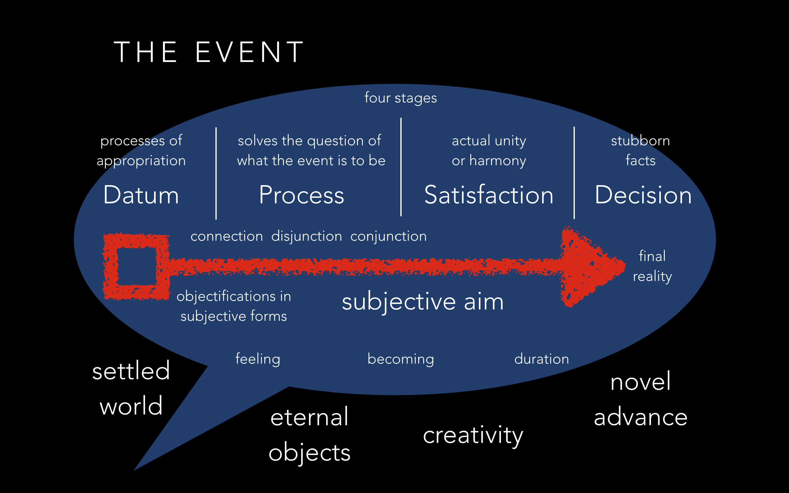

You can see the four stages.

On one side, the datum is the objective content of the experience: facts from the settled world.

On the other side, the decision “constitutes the event’s actuality, as stubborn fact which cannot be evaded.”

Whitehead wrote, “THUS the ‘datum’ [stage] is the ‘decision received’ and the ‘decision’ [stage] is the ‘decision transmitted’.”

In between these two are process and satisfaction.

The process solves the question of what the event is to be. Finds a settlement in its datum. This is what Christopher Alexander calls “harmony-seeking computation”, which reflects Brian Goodwin’s work.

Satisfaction forms a subjective unity, or harmony. “Harmony” is used in same way in both Alexander and Whitehead. The final satisfaction is the individual unity of the event.

The subjective aim is a proposition. The subject of the event is the event itself. The function of a proposition is to lure feeling.

The feelings are what they are in order that their subject may be what it is. The feelings aim at the feeler, as their final cause. “A feeling is an aspect of its own subject.”

The becoming of the event is creativity under certain conditions. “It is only by means of its feelings that the subject objectively conditions the creativity transcendent beyond itself.”

Whitehead writes: “This conception of an actual entity in the fluent world is little more than an expansion of a sentence in the Timaeus [a book by Plato]: "But that which is conceived by opinion with the help of sensation and without reason, is always in a process of becoming and perishing and never really is.””

There’s one more thing I wanted to include here: Whitehead’s notion of function. Whitehead wrote, “To function is to contribute determination to the actual entities in the nexus of some actual world.” As Ward Cunningham wrote in Episodes, “Programming is the act of deciding now what will happen in the future.”

You can use the diagram to model anything by turning the different bits of text into questions.

So what does Domain Driven Design look like as an event?

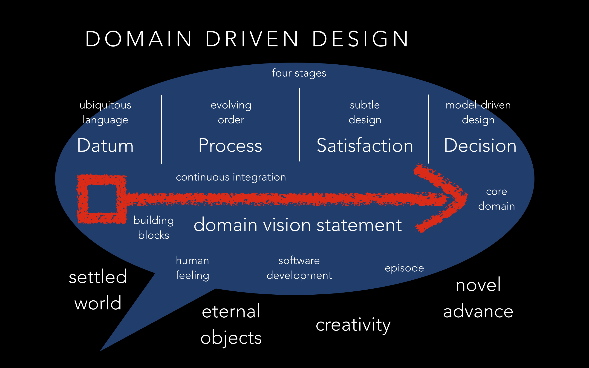

We point the way to the core domain with a domain vision statement. The domain vision statement functions as a subjective aim. The core domain of the software application is perhaps the final reality. We learn from the inside covers of the blue book that names from the bounded context and the core domain enter the ubiquitous language. Modelling out loud gives us an opportunity to feel how coherent the ubiquitous language is. This provides the possibilities for a more coherent unity. And so by using the building blocks and through a process of evolving order, we find satisfaction with a subtle design. The concrete result is a model-driven design. Perhaps if that doesn’t characterise the situation, it includes some of the main points?

What is a software development event?

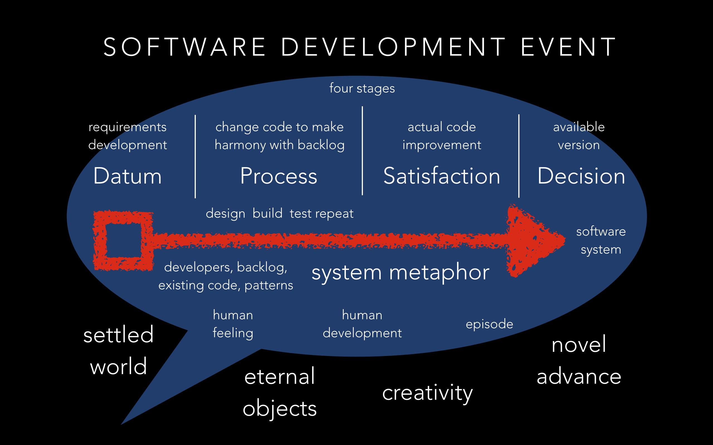

This diagram works for both adding and refactoring. Refactoring is an event, and so is adding. The difference is that refactoring makes a coherent unity from something that was troubling within the existing code. What is felt is a code smell. On the other hand, adding makes a coherent unity from the combination of existing code and the fact of an unsupported requirement.

Perhaps the trouble is the way developers are involved in the software development process, in each other, how their processes start to combine? How do you model that with events? How do such situations actually become functional, so that working software is produced?

I don’t have any a great new methodology to suggest, but perhaps we could be more definite that software development is an event. And perhaps it would help to be more definite about the human development events within software development. I don’t really know what that means, but now we know we are looking at events, and looking for patterns in events, rather than looking at patterns, perhaps we can find some new things to say about this.

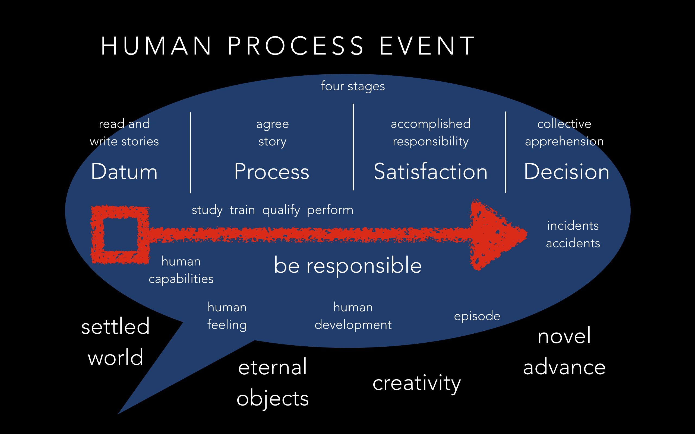

Here’s a diagram of human development as an event. Now I’m really getting out of my area… Something about the how-to genre. Something about informed consent. Something about responsibilities. But I don’t really have all the answers, so I’ll skip on….

So what happens if we look at a distributed system as a multiplicity of “process events” in which domain events may be generated? Can we be more definite about reliability in a distributed system that processes domain events, by being more definitive about what actually happens in that processing? If we want to make a system that is reliable, what can we actually rely on? Is it possible to define the process events in terms of only things we can actually rely on?

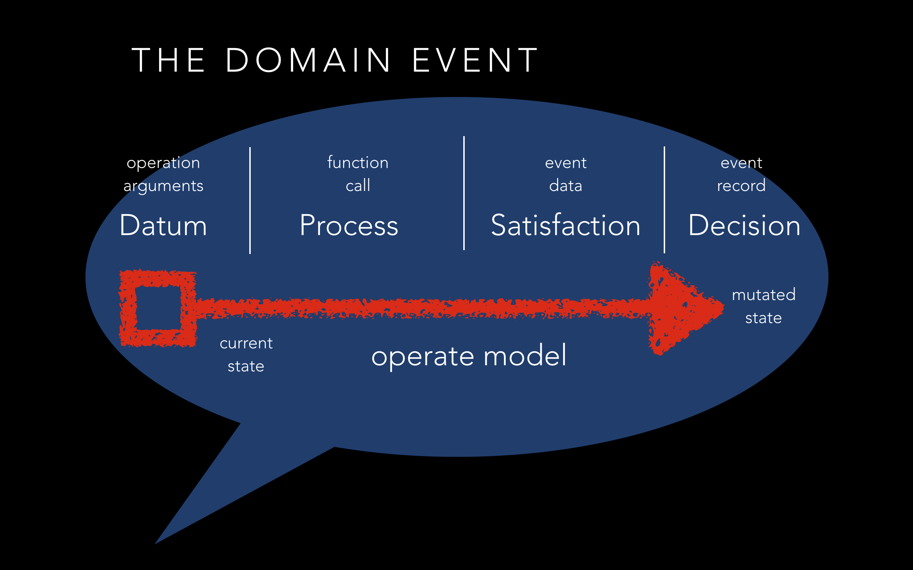

Let’s firstly pick out the domain model events. There’s an operation call, perhaps a command is executed. Let’s say an aggregate method is executed, and some domain events are produced. The stubborn facts are made when the domain events are written into a database.

So let’s say we process a command, and send notifications of the domain events over a message bus. This is unreliable for the reasons explained before: if the domain events are written first, then the notification might not be sent, and if the notification is sent first, then the domain events might not be written. Even if the domain events are written atomically, and the view updated atomically, it remains that the notification isn’t atomic with the domain events, and the consumption of the notification isn’t atomic with the updating of the view. So there’s lots of ways in which it can go wrong.

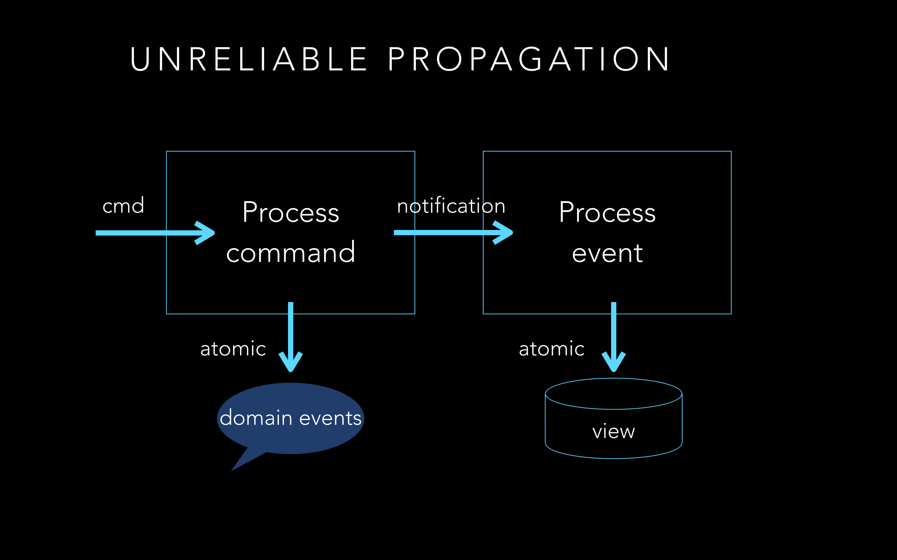

However, if the notifications and the domain events are written atomically. And if the view is updated atomically with a tracking record that shows which notification was last processed. And if we use counting to sequence and follow the notifications. And if processing is resumed using tracking information, then propagation and projection of the state of the application will be reliable. For details about doing this with notification logs, see the relevant section in the book Implementing Domain Driven Design by Vaughn Vernon. We can take this at least one step further, by replacing the view with an event sourced model.

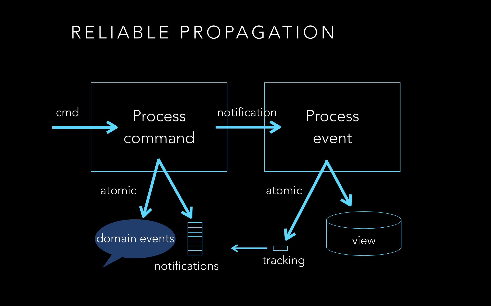

If we make the view event sourced, then we are basically projecting the state of one application into the state of another application. In this case, we have to put three things in the database atomically: the tracking, the domain events, and the notifications. That more or less defines what a process event is.

Using only counting and local atomic database transactions, so long as the infrastructure allows the process to advance at all, the event processing can advance reliably.

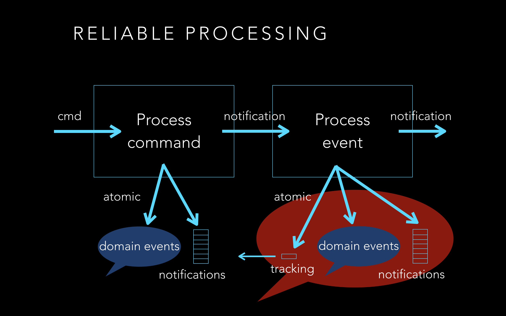

The new notifications allow the projected state to be propagated to another application. In this way, such applications can be composed to make a reliable distributed system. Such a system is as reliable as its atomic database transactions.

Here’s that process event, drawn as an event.

The “subjective aim” is perhaps to keep up-to-date?
The “datum” is more or less the domain event notification, the current application state, and the application policy itself.
The “process” is to apply the application policy whenever there is a new domain event notification.
The “satisfaction” is the new domain events that satisfy the application policy.
The “decision” is whether records of the process event are actually written into the database, or perhaps not depending on infrastructure failure.
Hence application state becomes mutated.

Here’s the process event written as a design pattern. I won’t read it all out, it probably needs more work, but basically it says that by using counting to sequence the domain events of an application, and atomic database transactions to record each process event, application state will be entirely unaffected by infrastructure failures.

> "A set of EVENT SOURCED APPLICATIONS can be composed into a system of applications. Application state can be propagated to other applications. Application state is defined by domain event records that have been committed. Each application has a policy which defines how it responds to the domain events it processes.
>
> Infrastructure may fail at any time. Although committed database transactions are expected to be durable, the operating system processes, the network, and the databases may go down at any time. Depending on the system design, application state may be adversely affected by infrastructure failures.
>
> Therefore…
> 
> Use counting to sequence the domain events of an application. Use a unique constraint to make sure only one domain event is recorded for each position. Ensure there are no gaps by calculating the next position from the last recorded position. Also use counting to follow the domain events of an upstream application. Use a tracking record to store the current position in the upstream sequence. Use a unique constraint to make sure tracking can be recorded for each upstream domain event only once.
>
> Use atomic database transactions to record process event atomically. Include the tracking position, the new domain events created by application policy, and their position in the application’s sequence.
>
> Then, the distributed system can be considered reliable in the sense that the facts in the database will represent either that a process event occurred or that it didn’t occur, and so application state will by entirely unaffected by infrastructure failures.
>
> Event sourced applications may be implemented with EVENT SOURCED AGGREGATES.  To scale the system, use CAUSAL DEPENDENCIES to synchronise parallel pipelines. Use SYSTEM RUNNERS to bind system to infrastructure it needs to run."

This really helps to keep focus on the domain driven design when developing a distributed system.

* Factoring out the “process event" functionality allows an entire system of applications to be defined independently
 of infrastructure (not just domain model)
* Infrastructure involved only when system is run
* Runners for single-threaded development and testing, multithreading, multiprocessing, clocked stepping, actors…
* More time available for domain driven design! :)

I thought I should mention, there is working code for all of this in a project on GitHub, my library for event sourcing in Python. I don’t know how many people here use Python? In DDD terms, this is a “cohesive mechanism”. Eric Evans wrote,

> Partition a conceptually COHESIVE MECHANISM into a separate lightweight framework. Particularly watch for formalisms for well-documented categories of algorithms. Expose the capabilities of the framework with an INTENTION-REVEALING INTERFACE. Now the other elements of the domain can focus on expressing the problem (‘what’), delegating the intricacies of the solution (‘how’) to the framework.

To round off… As the dictionary said, we can use events to describe everything that happens in a domain. And now we know what an event actually is, we can see that every domain can be exhaustively described with events.

My hope is that, as you start see everything as an event, you feel more real and more alive, and so can operate with more definiteness than before. As Whitehead said, “there’s no going behind the events to find something more real.”

In other words, we exclude nothing by tackling complexity in a domain by its events. I think that’s a useful thing to know.

That’s all I got. Thanks for listening.

END 